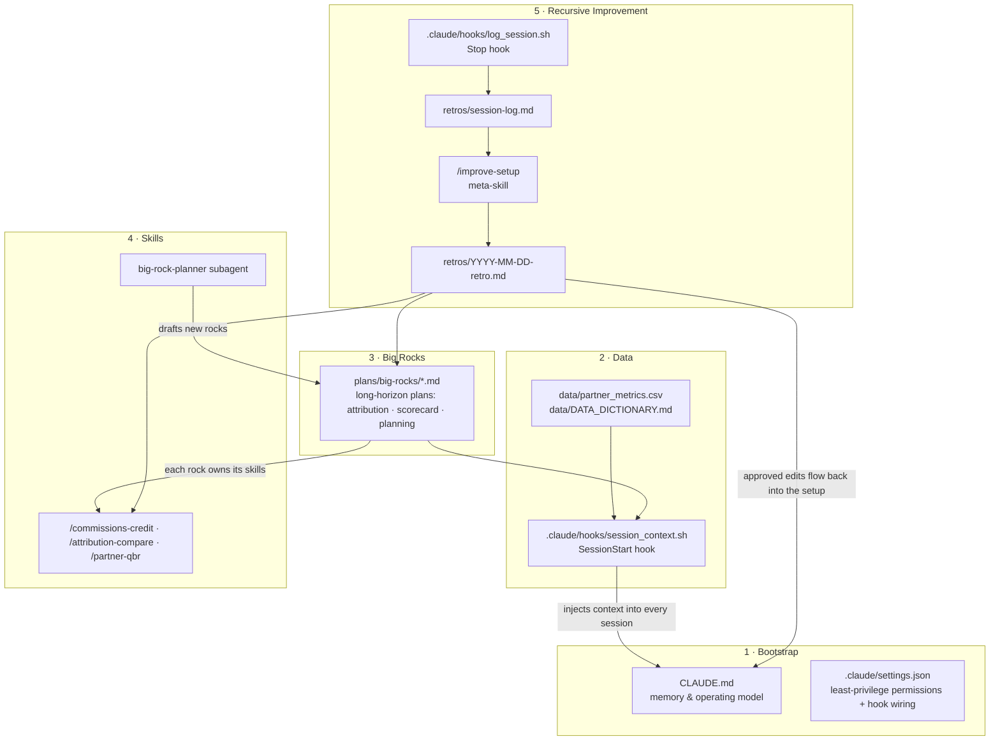

# Claude Code as an Operating System

Most people use Claude Code as a chat tool: open a session, describe a task,
accept the diff, close the session — and every session starts from zero. This
repo demonstrates the alternative: Claude Code run as an **operating system**
for a function (here, GTM / Partner Ops), where every session boots with
memory and live data, work is organized against long-horizon plans, repeated
work hardens into skills, and the setup reviews and rewrites itself. Nothing
here is a mockup — every file described below exists in this repo, the hooks
run, the skills are invocable, and the portfolio app parses these files at
runtime.

## The five layers



The arrow that matters is the last one: retro output edits `CLAUDE.md`, the
skills, and the plans — the loop's subject is the setup itself.

### 1 · Bootstrap — the first instance done right

[`CLAUDE.md`](../CLAUDE.md) is project memory: repo map, conventions (fiscal
calendar, currency formatting, metric naming), and the operating model every
session follows. [`.claude/settings.json`](../.claude/settings.json) is
deliberate least-privilege: reads and `python3` are pre-approved, `git push`
and writes to the metrics CSV require confirmation, `.env` reads are denied.
The point: setting up Claude Code on a repo is a design decision, not a
default.

### 2 · Data — every session wakes up informed

The [SessionStart hook](../.claude/hooks/session_context.sh) (POSIX sh + awk,
zero dependencies) parses big-rock statuses from the plan frontmatter and
headline figures from the scorecard CSV, and injects them into context before
the first prompt. [`data/DATA_DICTIONARY.md`](../data/DATA_DICTIONARY.md) is
the single source of truth for every metric definition and threshold — skills
read it instead of embedding their own logic.

### 3 · Big rocks — long plans, not long prompts

Strategic initiatives live as long-horizon plan documents in
[`plans/big-rocks/`](../plans/big-rocks/00-INDEX.md), each with status,
checkboxed milestones, open questions, and an **Improvement Log**. The three
rocks deliberately show the lifecycle: attribution and scorecard are `active`
with shipped skills; [partner planning](../plans/big-rocks/partner-planning.md)
is honestly still `planned`, with its first skill existing only as a proposal —
because a setup where everything is green is a setup that was staged.

### 4 · Skills — repeated work, hardened

Each domain skill is owned by exactly one rock and declares its own tool
scope:

| Skill | Owning rock | Notable constraint |
|---|---|---|
| [`/commissions-credit`](../.claude/skills/commissions-credit/SKILL.md) | partner-compensation | authors rules only; the money math is tested code, never a prompt |
| [`/attribution-compare`](../.claude/skills/attribution-compare/SKILL.md) | partner-attribution | read-only; weights live in the plan, not the skill |
| [`/partner-qbr`](../.claude/skills/partner-qbr/SKILL.md) | partner-scorecard | read-only; benchmarks against tier medians |

The [`big-rock-planner`](../.claude/agents/big-rock-planner.md) subagent
drafts new rock plans to template — read-only, returns text for review.
Recomputing tiers and health flags is deliberately *not* a skill — it lives as
an analysis notebook (`notebooks/scorecard_refresh.ipynb`), because a periodic
close-time recompute a human eyeballs isn't a recurring agent action.

## The headline system: commissions crediting

Crediting is the strongest thing in this repo to study, because it's a real
**multi-stakeholder** workflow and it draws the line between what an LLM should
and shouldn't do.

**The problem.** Partner crediting is genuinely hard: reps join mid-quarter,
hand off territories, and cover overlapping slices of segment × region × motion.
That intent is maintained by managers in a Google Sheet, in plain English —
"Maria takes over the SMB book from Sam on March 15" — not in rules. Get it
wrong and the wrong person is paid for the wrong months.

**The stakeholders, and where each one touches the system:**

- **Managers** author coverage in [`data/coverage_assignments.csv`](../data/coverage_assignments.csv) — plain English, no schema to learn.
- **The agent** ([`/commissions-credit`](../.claude/skills/commissions-credit/SKILL.md)) reads that intent and codifies it into effective-dated rules in [`data/crediting_rules.json`](../data/crediting_rules.json), resolving the handoff so there's no gap and no double-coverage.
- **Finance** runs actuals: the deterministic engine applies the rules to [`data/commission_deals.csv`](../data/commission_deals.csv).
- **Reps** land on the right comp line — a PSM on the revenue line, a PAM on the coverage line, for the months they actually owned the territory.

**The design boundary — the part worth interviewing on.** The LLM does only the
ambiguous half: turning prose into structured rules. The money — applying rules
to deals — is [`crediting/engine.py`](../crediting/engine.py), plain Python with
golden tests in [`tests/`](../tests/test_crediting.py) covering mid-quarter
hires, territory handoffs at the boundary, split credit, and coverage gaps. No
model ever computes a credited dollar. And an uncredited deal is surfaced, never
silently zeroed — a gap at actuals time is a crediting hole to fix, not a zero
to pay. That separation — AI for judgment, tested code for money — is the whole
point.

### 5 · Recursive improvement — the setup edits itself

The [Stop hook](../.claude/hooks/log_session.sh) appends a line per session to
[`retros/session-log.md`](../retros/session-log.md). Periodically,
[`/improve-setup`](../.claude/skills/improve-setup/SKILL.md) reviews that log,
recent git history, and every plan, hunting for friction: instructions the
user keeps repeating (→ CLAUDE.md convention), skills that needed manual
correction (→ SKILL.md edit), stale milestones, recurring tasks with no
owning skill (→ new skill proposal). It writes a dated retro with diff-style
proposed edits, applies only what's approved, and logs each applied edit in
the owning rock's Improvement Log.

[`retros/2026-06-05-retro.md`](../retros/2026-06-05-retro.md) is a completed
iteration: three observations, two edits applied, one deferred into a new big
rock — the loop, visibly run once.

## Try it yourself

```bash
# the data layer, standalone — what every session sees at boot
bash .claude/hooks/session_context.sh

# the money path is real and tested — no LLM in this loop
python3 tests/test_crediting.py

# run actuals against the sample deal book
python3 -c "from crediting.engine import apply_rules, load_rules, load_deals; \
lines, gaps = apply_rules(load_rules(), load_deals()); \
print(len(lines), 'credited lines;', len(gaps), 'uncredited')"

# then open Claude Code in this repo:
#   - the SessionStart context appears automatically
#   - type / and you'll see: commissions-credit, attribution-compare,
#     partner-qbr, improve-setup
#   - /commissions-credit codifies the coverage sheet, then verifies it
#   - /improve-setup runs a live retro against this very setup
```

## Why this matters for GTM

This architecture is a GTM operating cadence translated into tooling. Big
rocks are the annual planning pillars; skills are the repeatable plays;
the data dictionary is the metrics governance layer; the improvement loop is
the QBR — applied to the tooling itself. The strategist's job isn't to prompt
well; it's to design the system so that every session, by default, compounds.
